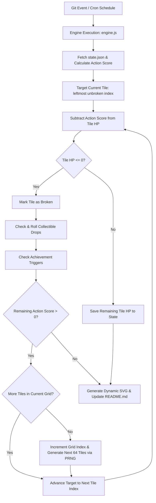
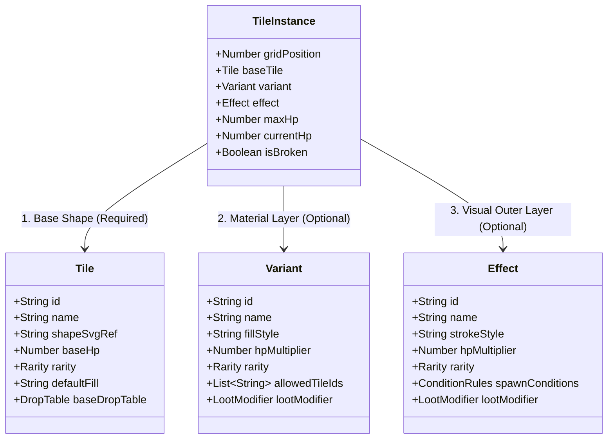
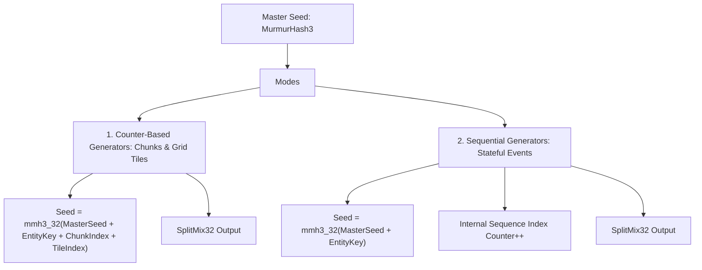
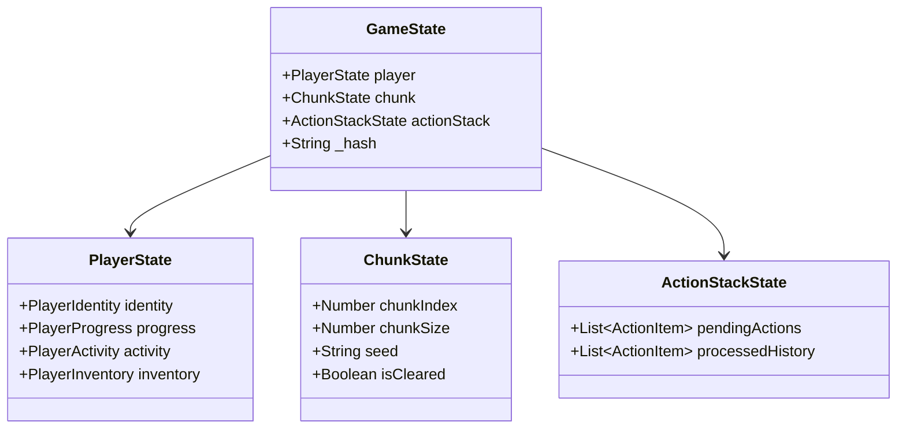
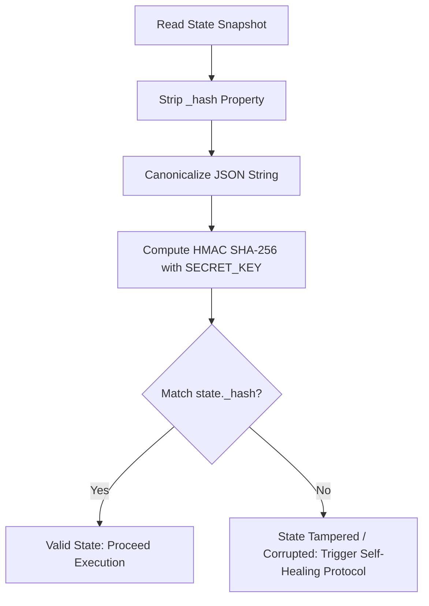
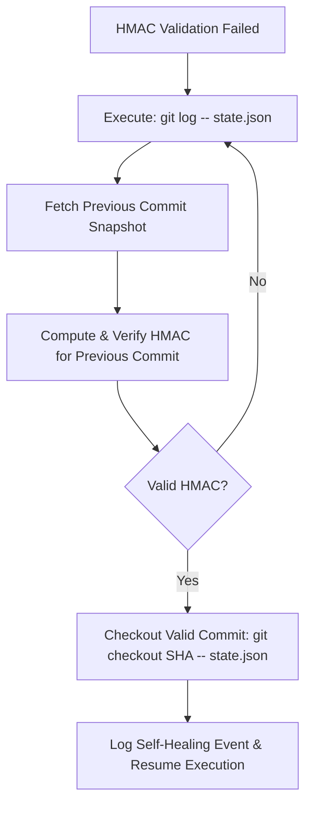
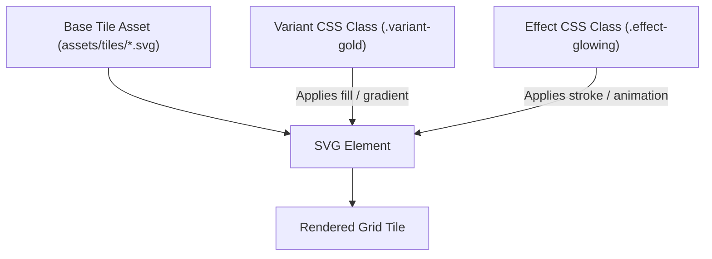

# BREAKME - Game Design Document (GDD)

> Single source of truth for BREAKME game rules, engine mechanics, state schemas, and visual architecture.

---

## 1. Game Concept & Core Loop

**BREAKME** is an idle incremental block-mining game embedded directly within a developer's GitHub profile `README.md`. Game progression is driven by real-world `git` activity and profile usage statistics.

### Key Mechanics & Rules
- **Grid Layout**: A 64-tile grid (8x8 visual wrapping grid). In engine memory/state, tiles are stored as a flat 1D array (`tiles[0..63]`).
- **Sequential Progression & Overflow Damage**:
  - Damage is applied sequentially to tiles from left to right (`index 0 -> 63`).
  - When an Action Score is applied, if a tile's HP reaches `<= 0` and remaining Action Score `> 0`, **overflow damage carries over** to the next tile immediately within the same cycle.
- **Continuous Seeded Grid Generation**:
  - The game seed is derived continuously from the player's GitHub Username / User ID.
  - When all 64 tiles in a grid are broken (`gridIndex`), the engine deterministically generates the next 64-tile grid derived from `PRNG(seed, gridIndex + 1)`.
- **3-Layer Stacking Entity System**:
  - **Layer 1: Base Tile Shape** *(Required)*: Base visual outline, base HP, base drop table.
  - **Layer 2: Material Variant** *(Optional)*: Visual fill/gradient overlay, HP bonus, score multipliers.
  - **Layer 3: Effect Modifier** *(Optional)*: Border/glow style, keyframe animation, visual overlays, special hit modifiers.
  - *Tile Composition*: A tile can consist of 1 layer (Base), 2 layers (Base + Variant OR Base + Effect), or 3 layers (Base + Variant + Effect).
- **Git Action Scoring**:
  - Engine parses user statistics: Action Type (`commit`, `PR merge`, `issue`), daily frequency, day consistency, period between actions, and active streaks.
  - Generates an **Action Score** subtracted from the current target tile's HP.
- **Collectibles & Achievements**:
  - Breaking tiles drops collectibles into the player's permanent Collection Log based on drop rates and unlock conditions.
  - Achievements trigger upon reaching progress milestones, breaking rare blocks, or achieving specific Git activity metrics.

---

## 2. Execution & Multi-Tile Hit Resolution Flow

---

## 3. Entity Specifications & 3-Layer Stacking Architecture

This section defines all primary domain entities in **BREAKME**.

### 3.1 World Entities & 3-Layer Block Composition

A tile block on the grid is composed of up to 3 stacked entity layers:

#### Layer 1: Base Tile Shape (`Tile`)
- **Role**: Defines the fundamental vector geometry shape and baseline health.
- **Visuals**: SVG `<path>` shape reference. Renders with `defaultFill` if no Variant is applied.
- **Properties**: `id`, `name`, `baseHp`, `rarity` (`common`, `uncommon`, `rare`, `legendary`), `baseDropTable`.

#### Layer 2: Material Variant (`Variant`)
- **Role**: Overlays material styling and scales block durability.
- **Visuals**: Replaces fill with solid colors, linear/radial gradients, or vector SVG patterns.
- **Properties**:
  - `hpMultiplier`: Scales tile HP (`Base HP * hpMultiplier`).
  - `rarity`: Determines spawn frequency.
  - `allowedTileIds`: Restricts variant to specific Tile types (optional).
  - `lootModifier`: Modifies drop pools (expands, shrinks, or replaces drop rates).

#### Layer 3: Effect Modifier (`Effect`)
- **Role**: Applies an outer stroke boundary/glow and special gameplay modifiers.
- **Visuals**: Renders outer stroke/outline styling (colors, dash patterns, CSS keyframe animations).
- **Properties**:
  - `hpMultiplier`: Secondary durability scalar.
  - `rarity`: Determines spawn frequency.
  - `spawnConditions`: Restricts appearance to specific Tiles, position indices, or Tile+Variant combos.
  - `lootModifier`: Secondary drop pool modifier.

#### Combined Tile Health Formula
$$\text{Max HP} = \lceil \text{Tile.baseHp} \times \text{Variant.hpMultiplier} \times \text{Effect.hpMultiplier} \rceil$$
*(Note: If Variant or Effect is missing, their multiplier defaults to 1.0)*

---

### 3.2 Player Entity (`Player`) & State Protection Architecture

The **Player Entity (`Player`)** represents the user's persistent profile, progression metrics, seed state, and meta-inventory stored within `state.json`.

---

#### 3.2.1 Player Schema & Properties

1. **Identity (`identity`)**:
   - `username`: String — GitHub username (e.g., `caylakym`).
   - `firstRunTimestamp`: ISO Timestamp — Immutable timestamp recorded when `engine.js` runs for the very first time on the repository.
   - `baseSeed`: String — Unique deterministic base seed calculated as:
     $$\text{baseSeed} = \text{SHA256}(\text{username} + \text{"\_"} + \text{firstRunTimestamp})$$

2. **Core Grid Progress (`progress`)**:
   - `currentChunkIndex`: Number — Current chunk/grid iteration counter (`0`, `1`, `2`, ...).
   - `currentTileIndex`: Number — Current targeted tile index within the active 64-tile grid (`0..63`).
   - `totalTilesBroken`: Number — Lifetime cumulative broken blocks metric.

3. **Activity & Streak Stats (`activity`)**:
   - `currentStreak`: Number — Active consecutive days with recorded Git actions.
   - `highestStreak`: Number — Personal peak consecutive day streak.
   - `lastActiveDate`: String — ISO Date string (`YYYY-MM-DD`) of last processed action.
   - `topStats`: Object — Container for peak performance records (e.g., `{ "maxDailyCommits": N, "maxStreak": N }`), expandable for future high-stat tracking.

4. **Meta Inventory (`inventory`)**:
   - `collectibles`: Map<String, ISOTimestamp> — Map of unlocked collectible IDs and unlock timestamps.
   - `achievements`: Map<String, AchievementState> — Map of achievement IDs, boolean status (`isUnlocked`), and `unlockedAt` timestamp.

---

#### 3.2.2 Integrity Seal & Git-Based Self-Healing

To guard against manual text edits, schema corruption, or raw JSON tampering on `state.json`:

1. **HMAC SHA-256 Checksum (`_hash`)**:
   - Root `state.json` contains a `_hash` property.
   - During execution, `engine.js` computes `HMAC_SHA256(cleanState, SECRET_KEY)` and validates it against `_hash`.
2. **Git Commit History Fallback (Self-Healing)**:
   - If `_hash` verification fails (indicating manual tampering or corrupted JSON syntax), `engine.js` automatically fetches the last valid, signed `state.json` directly from `git log` / previous commit history, restoring valid state before running the current turn.

---

### 3.3 Collectible Entity (`Collectible`) & Spawn Conditions (`SpawnCondition`)

Collectibles represent the primary long-term progression metric in **BREAKME**. Breaking tile blocks can drop unique collectibles that permanently populate the player's profile README **Trophy Cabinet**.

#### 3.3.1 Collectible Properties (`Collectible`)
- **`id`**: String — Unique identifier (e.g., `gem_ruby`, `fossil_amber`, `relic_core`).
- **`name`**: String — Display title.
- **`visualDesign`**: SVG Ref — Vector graphic asset / symbol reference rendered in the SVG defs.
- **`rarity`**: Rarity Enum — `common`, `uncommon`, `rare`, `epic`, `legendary`.
- **`spawnCondition`**: SpawnCondition Entity / Schema — Rules governing when and where this item can drop.
- **`description`**: String — Lore / flavor text displayed on hover or detail view.

#### 3.3.2 Spawn Condition Entity (`SpawnCondition`)
To support flexible drop requirements, drop eligibility is evaluated via a structured `SpawnCondition` entity:
- **`id`**: String — Unique condition set identifier.
- **`dropWeight`**: Number — Base drop probability weight when condition criteria are met.
- **`allowedTileIds`**: List<String> *(Optional)* — Restricts drop to specific base Tile shapes.
- **`allowedVariants`**: List<String> *(Optional)* — Restricts drop to specific Material Variants.
- **`allowedEffects`**: List<String> *(Optional)* — Restricts drop to specific Effect Modifiers.
- **`minGridIndex`**: Number *(Optional)* — Minimum grid depth required before this item can appear.
- **`gitActionTypes`**: List<String> *(Optional)* — Restricts drop to hits triggered by specific Git actions (e.g., `commit`, `pr_merge`, `issue`).

#### 3.3.3 Collection & Loot Pool Exhaustion Logic
1. **Loot Roll on Tile Break**: When a tile HP reaches `<= 0`, the engine evaluates all `Collectible` entries whose `SpawnCondition` criteria match the current tile, variant, effect, and Git action context.
2. **Dynamic Pool Exhaustion**:
   - Collectibles already present in `Player.collectibles` are **excluded from future loot rolls**.
   - Removing collected items dynamically shifts remaining probability weights, progressively **increasing the drop chance for uncollected collectibles**.
3. **Automatic Acquisition & Trophy Cabinet**:
   - Upon dropping, the item is automatically added to `Player.collectibles`.
   - The SVG renderer updates the user's permanent **Trophy Cabinet / Table** view in the profile `README.md`.

---

### 3.4 Achievement Entity (`Achievement`) & Condition Schema

Achievements represent the meta progression layer of **BREAKME**, rewarding long-term player milestones, Git activity streaks, block-breaking feats, and collection progress.

#### 3.4.1 Achievement Properties (`Achievement`)
- **`id`**: String — Unique achievement identifier (e.g., `streak_7day`, `blocks_broken_100`, `master_collector`).
- **`title`**: String — Display title.
- **`description`**: String — Goal explanation / unlock instructions.
- **`badgeSvgRef`**: SVG Ref — Vector badge icon reference rendered in the SVG defs.
- **`rarity`**: Rarity Enum — `common`, `uncommon`, `rare`, `epic`, `legendary`.
- **`conditions`**: List<AchievementCondition> — Array of 1 or more condition criteria required to unlock.
- **`isUnlocked`**: Boolean — Per-player unlocked status indicator.
- **`unlockedAt`**: ISO Timestamp / Null — Timestamp when the achievement was achieved.
- **`reward`**: Reward Object *(Optional)* — Optional score multiplier bonus, special badge border, or cosmetic variant unlock.

#### 3.4.2 Achievement Condition Entity (`AchievementCondition`)
An achievement can define singular or multiple conditions (ALL conditions required for unlock):
- **`id`**: String — Unique condition rule identifier.
- **`metricType`**: Metric Enum — Category of stat being tracked by the engine:
  - **Progress Metrics**: `blocks_broken_total`, `grid_index_depth`, `overflow_damage_total`, `collectibles_found_count`.
  - **Git Activity Metrics**: `git_commits_total`, `git_pr_merges_total`, `git_streak_days`.
  - **Interaction Feats**: `rare_variant_broken`, `legendary_effect_broken`, `full_grid_cleared_single_action`.
- **`targetValue`**: Number / String — The numerical threshold or ID required for completion.
- **`comparisonOperator`**: Operator Enum — `>=` (greater than or equal), `==` (exact match), `<=` (less than or equal).

#### 3.4.3 Unlock Evaluation Lifecycle
1. **Trigger Checks**: The engine evaluates locked achievements automatically after major game events (Git stats update, tile destruction, collectible drop, grid reset).
2. **Multi-Condition Validation**:
   - The engine validates every `AchievementCondition` in `achievement.conditions`.
   - If ALL conditions pass their `comparisonOperator` checks against player metrics, the achievement transitions to unlocked.
3. **Meta Progression State Update**:
   - Updates `Player.achievements[id].isUnlocked = true` and records `unlockedAt`.
   - Unlocked achievement badges populate the **Achievement Gallery / Badge Shelf** in the SVG profile `README.md`.

---

### 3.5 Chunk Entity (`Chunk`) & Grid Generation Strategies

A `Chunk` represents a discrete 64-tile grid section (rendered visually as an 8x8 matrix on the player's profile `README.md` SVG).

#### 3.5.1 Chunk Properties (`Chunk`)
- **`chunkIndex`**: Number — Sequential grid counter (`0`, `1`, `2`, ...).
- **`chunkSize`**: Number — Total tiles per grid (Default: `64`).
- **`seed`**: String / Hash — Deterministic seed derived from player identity and grid index.
- **`tiles`**: Flat Array<TileInstance> (Size: `64`) — Array of 64 sequential tile instances (`tiles[0..63]`).
- **`isCleared`**: Boolean — Evaluates to `true` when all 64 tiles reach `HP <= 0`.
- **`generatedAt`**: ISO Timestamp — Grid generation timestamp.

#### 3.5.2 Seed Derivation Logic
The chunk seed guarantees reproducible and deterministic grid generation:
$$\text{Seed} = \text{SHA256}(\text{GitHub Username/ID} + \text{"\_"} + \text{chunkIndex})$$
*(Note: Initial grid derivation uses current timestamp + Username/ID, while subsequent grid resets chain `chunkIndex` into the seed generator).*

#### 3.5.3 Tile Layer Generation Strategies
When generating the 64 tile instances for a chunk, the generator selects layer combinations (`Base Tile` + optional `Variant` + optional `Effect`) using one of two candidate generation architectures:

* **Option A: Compound ID Value Mapping (Single Roll)**
  - Generator rolls a single pseudo-random value `V = PRNG(seed, tilePosition)`.
  - Value `V` indexes directly into a pre-configured probability distribution lookup table containing valid layer combinations (e.g., `stone_base + iron_variant + glow_effect`).

* **Option B: Multi-Layer Independent Probabilistic Roll (Layered Roll)**
  - Generator executes 3 independent sequential rolls per tile position:
    1. **Roll 1 (Base Shape)**: `PRNG(seed, pos, "tile")` determines base tile shape (`Tile`).
    2. **Roll 2 (Material Fill)**: `PRNG(seed, pos, "variant")` determines optional material fill (`Variant`).
    3. **Roll 3 (Outer Outline)**: `PRNG(seed, pos, "effect")` determines optional outer outline/glow (`Effect`).

*(Both options are documented as candidates for final benchmarking in Section 5: Seeded PRNG).*

---

### 3.6 Action Stack Entity (`ActionStack`) & Action Item Entity (`ActionItem`)

The **Action Stack** is the primary event ingestion queue of **BREAKME**. It buffers incoming activity events before they are evaluated into hit damage against tiles in the active chunk grid.

#### 3.6.1 Action Item Entity (`ActionItem`)

An `ActionItem` represents a single, discrete activity payload queued within the `ActionStack`.

##### Privacy-First Data Guarantee
To ensure complete privacy and compliance when running on public repositories or processing commits originating from private/enterprise workspaces:
- **Zero Metadata Inspection**: No commit messages, code diffs, file names, directory structures, branch names, or author personal details are ever parsed or stored in state.
- **Hashed Identifiers**: Raw SHA hashes are salted/hashed to prevent reverse lookup of private repository commits.

##### Schema & Properties
- **`id`**: String — Unique identifier generated by the engine (e.g., `act_9f8a7b6c`).
- **`category`**: Category Enum — `git_client` (Native Git CLI) or `github_platform` (GitHub Web/API).
- **`actionType`**: ActionType Enum — Specific event trigger type (e.g., `commit`, `pr_merge`, `release`).
- **`count`**: Number — Quantity of atomic units represented (e.g., `5` for a 5-commit atomic push).
- **`timestamp`**: ISO Timestamp — UTC timestamp of event creation.
- **`calculatedScore`**: Number / Null — Damage score assigned upon evaluation *(Refer to Section 3.7 for scoring details)*.
- **`isProcessed`**: Boolean — `false` while in pending queue; `true` once applied to tile HP.

---

#### 3.6.2 Category Classification

Action items are split into three distinct categories based on their origin, transport layer, and calculation scope:

##### Category A: Native Git Client Actions (`git_client`)
Actions originating from the developer's local `git` CLI and uploaded via `git push`:
- **`commit`**: Individual commit created locally and pushed to the repository. *(Note: Atomic pushes containing multiple commits yield `count = N`)*.
- **`branch_push`**: Creation of a new branch ref on remote.
- **`tag_push`**: Push of a native Git tag ref (`refs/tags/*`).
- **`merge_commit`**: Push of a non-fast-forward merge commit.

##### Category B: GitHub Platform Actions (`github_platform`)
Actions originating on GitHub's web interface, API, or automated workflows:
- **`pr_merge`**: Execution of a Pull Request merge.
- **`issue_event`**: Creation or resolution of an issue.
- **`release_published`**: Publication of a GitHub Release entity.
- **`deployment_event`**: Triggering of a GitHub Deployment status.

##### Category C: Progress-Based Actions (`progress_analytics`)
Actions generated by the engine by calculating activity analytics across time windows (daily, weekly, monthly, yearly):
- **`daily_activity_milestone`**: Triggered when a player reaches daily commit/activity thresholds on a given day.
- **`streak_increment`**: Triggered when a player maintains active daily Git usage without breaking their consecutive day streak.
- **`record_activity_day`**: Triggered when a player sets a personal activity record (e.g., highest daily commit count for the month, year, or all-time).

---

#### 3.6.3 Action Stack Queue Architecture (`ActionStack`)

The `ActionStack` maintains state within `state.json` via two arrays:

1. **`pendingActions` (`List<ActionItem>`)**: First-In, First-Out (FIFO) queue of unprocessed action items waiting to damage active grid tiles.
2. **`processedHistory` (`List<ActionItem>`)**: Rolling historical record of processed actions used for audit logging, anti-duplication validation, and streak calculations.

##### Placeholders
- `[TBD: Maximum Pending Queue Capacity]`
- `[TBD: Processed History Retention Limit]`

---

#### 3.6.4 Queue Ingestion & Anti-Duplication Lifecycle

1. **Event Capture**:
   - **Direct Push / Workflow Payload**: Captured via `github.event` context during GitHub Action runs (`mine.yml`).
   - **Cron Polling Sync**: Captured via GitHub GraphQL API during scheduled cron runs.
2. **Deduplication Check**:
   - The engine computes a deterministic fingerprint for the incoming action.
   - If the fingerprint matches an entry in `pendingActions` or `processedHistory`, the event is discarded.
3. **Queue Push**:
   - Valid, non-duplicate actions are appended to `ActionStack.pendingActions`.

### 3.7 Damage Entity (`Damage`) & Action Relations

The **Damage Entity (`Damage`)** represents the final numerical HP reduction applied directly to tiles in the active chunk grid when processing an `ActionItem` from the `ActionStack`.

---

#### 3.7.1 Damage Calculation & Action Relations

1. **`commit` (Base Action)**:
   - Evaluates to a base score of `1.0 DMG` per commit.
   - Directly contributes to the primary `Damage` output applied to target tiles.
   - For atomic multi-commit pushes (`count = N`), total damage scales proportionally by `N` ($N \times 1.0$).

2. **Branch Damage Pool (`branch_create`, `merge_commit`, `branch_delete`)**:
   - **`branch_create`**: Initializes a secondary damage pool (`branchDamagePool[branchId] = 0`). Subsequent commit activity on this branch accumulates score into this secondary pool.
   - **`merge_commit` / Merge Action**: Upon merging, the score accumulated in `branchDamagePool[branchId]` is released with a $1.25\times$ bonus multiplier ($\text{branchDamagePool} \times 1.25$) and applied directly to the active tile grid.
   - **`branch_delete`**: If a branch is deleted without merging, its associated `branchDamagePool[branchId]` is discarded.

3. **Tag Actions & Achievement Triggers (`tag_push`, `tag_delete`)**:
   - Tag operations primarily serve as triggers for meta-progression achievements:
     - **Achievement: *"Seems important."***: Unlocks automatically when a Git tag is pushed for the first time.
     - **Achievement: *"TODO: Don't forget this."***: Has a 1% chance (`0.01` roll) to trigger on any `tag_push` or `tag_delete` operation.
   - *(Note: Additional Action Items can also trigger specific achievements as defined across the GDD).*

4. **Progress-Based Multipliers & Record Bonuses (`progress_analytics`)**:
   - **Streak Multipliers**: Active consecutive day streaks (`streak_increment`) scale outgoing damage by $+0.1$ per day, capping at $4.0\times$.
   - **Record Activity Multipliers**: Setting a personal daily damage peak (`record_activity_day` for month, year, or all-time) applies a high-value multiplier to that day's damage output ($1.25\times$ for Monthly, $1.55\times$ for Yearly, and $1.85\times$ for All-Time record days).

---

## 4. Git Activity & Damage Formulas

This section specifies the mathematical equations, multipliers, and overflow loop used by `engine.js` to process `ActionItem`s into grid tile destruction.

---

### 4.1 Base Damage Matrix

The initial base damage generated by an `ActionItem` before applying activity multipliers is defined as:

$$\text{BaseDamage}(\text{action}) = \text{count} \times \text{BaseWeight}(\text{actionType})$$

1. **`commit`**:
   $$\text{BaseDamage} = \text{count} \times 1.0$$
2. **`branch_create`**:
   Initializes `branchDamagePool[branchId] = 0`.
3. **`merge_commit`**:
   $$\text{BaseDamage} = \text{branchDamagePool}[\text{branchId}] \times 1.25$$
4. **Platform Events (`issue_event` / `release_published`)** *(Optional Future Placeholders)*:
   $$\text{BaseDamage} = \text{Optional Platform Bonus}$$

---

### 4.2 Activity Multipliers & Personal Record Bonuses

1. **Streak Multiplier Formula**:
   Consecutive active days apply a scaling multiplier to outgoing damage:
   $$\text{StreakMultiplier} = 1.0 + \min\left((\text{currentStreak} - 1) \times 0.1, 3.0\right) \quad (\text{Caps at } 4.0\times)$$

2. **Personal Record Activity Multipliers**:
   Setting a personal daily damage peak scales outgoing daily damage:
   - **Monthly Record (`record_activity_day`)**: $\text{Damage} \times 1.25$
   - **Yearly Record (`record_activity_day`)**: $\text{Damage} \times 1.55$
   - **All-Time Record (`record_activity_day`)**: $\text{Damage} \times 1.85$

3. **Combined Final Damage Equation**:
   $$\text{FinalDamage} = \text{BaseDamage} \times \text{StreakMultiplier} \times \text{RecordMultiplier}$$

---

### 4.3 Multi-Tile Hit Resolution & Overflow Pipeline

When `FinalDamage` ($D$) is evaluated against the current grid, the engine executes the following sequential hit resolution loop:

1. **Target Identification**:
   Select tile at index $i = \text{Player.progress.currentTileIndex}$.
2. **Damage Application**:
   - Compare $D$ against tile current HP ($H_i$):
     - **Case A: $D < H_i$**
       - Tile HP becomes $H_i - D$.
       - Remaining damage $D_{\text{remaining}} = 0$.
       - Save state and end cycle.
     - **Case B: $D \ge H_i$**
       - Tile $i$ HP becomes $0$ (`isBroken = true`).
       - Increment `Player.progress.totalTilesBroken`.
       - Roll for Collectible drops (Section 3.3) and Achievement unlocks (Section 3.4).
       - Calculate overflow damage: $D_{\text{remaining}} = D - H_i$.
       - Advance target tile index: $i \leftarrow i + 1$.
3. **Chunk Transition & Loop**:
   - If $i > 63$ (grid cleared):
     - Increment `Player.progress.currentChunkIndex`.
     - Reset $i = 0$ (`Player.progress.currentTileIndex = 0`).
     - Trigger Seeded PRNG (Section 5) to generate next 64 tiles for the new chunk.
   - If $D_{\text{remaining}} > 0$, set $D = D_{\text{remaining}}$ and repeat from Step 1.

##### Placeholders
- `[TBD: Base Commit Damage Weight]`
- `[TBD: Base Merge Damage Bonus]`
- `[TBD: Event Base Damage Bonus]`
- `[TBD: Streak Multiplier Step]`
- `[TBD: Max Streak Multiplier Cap]`
- `[TBD: Monthly / Yearly / All-Time Record Damage Bonuses]`

---

## 5. Seeded PRNG & Grid Generation Logic

This section specifies the random number generation architecture used by `engine.js` for deterministic grid building, layer rolls, loot drops, and achievement events.

---

### 5.1 Core Algorithms & Master Seed

1. **PRNG Algorithm**: `SplitMix32` (Fast, high-quality 32-bit state generator).
2. **Hash Algorithm**: 32-bit **MurmurHash3** (`mmh3_32`).
3. **Master Seed Derivation**:
   $$\text{MasterSeed} = \text{MurmurHash3}(\text{(username } \vert \text{ userId)} + \text{"\_"} + \text{firstRunTimestamp})$$

---

### 5.2 Dual Generator Modes: Counter-Based vs. Sequential

The engine utilizes two distinct PRNG generator modes depending on the entity type:

#### 1. Counter-Based Generator (Grid & Chunk Generation)
- **Role**: Stateless, position-dependent chunk and tile generation.
- **Mechanism**: Computes a unique seed for each tile position $i \in [0..63]$ within `currentChunkIndex` using entity key strings (`tile`, `variant`, `effect`).
- **Formula**:
  $$\text{TilePositionalSeed} = \text{MurmurHash3}(\text{MasterSeed} + \text{"\_"} + \text{EntityKey} + \text{"\_"} + \text{currentChunkIndex} + \text{"\_"} + i)$$
- **Benefit**: Reconstructs any 64-tile grid dynamically without storing 64 tile objects in `state.json`.

#### 2. Sequential Generator (Stateful Events & Loot Drops)
- **Role**: State-dependent rolls (e.g., loot drop tables, achievement triggers, special event occurrences).
- **Mechanism**: Maintains an independent internal sequence counter (`seqIndex`) per entity key.
- **Formula**:
  $$\text{Roll} = \text{SplitMix32}(\text{MurmurHash3}(\text{MasterSeed} + \text{"\_"} + \text{EntityKey}), \text{seqIndex}++)$$

---

### 5.3 3-Layer Tile Generation Algorithm

For each tile position $i \in [0..63]$ in grid `currentChunkIndex` (where `chunkSize = 64`):

1. **Layer 1: Base Tile Shape (`Tile`)**:
   - Seed: `MurmurHash3(MasterSeed + "_tile_" + chunkIndex + "_" + i)`
   - Output: Indexes into `assets/tiles/` base shapes distribution table.
2. **Layer 2: Material Variant (`Variant`)**:
   - Seed: `MurmurHash3(MasterSeed + "_variant_" + chunkIndex + "_" + i)`
   - Output: Indexes into `configs/variants.json` distribution table.
3. **Layer 3: Effect Modifier (`Effect`)**:
   - Seed: `MurmurHash3(MasterSeed + "_effect_" + chunkIndex + "_" + i)`
   - Output: Indexes into `configs/effects.json` distribution table.

---

## 6. Collectibles & Achievement Systems

This section details the loot distribution engine, dynamic loot pool exhaustion algorithm, and meta-achievement evaluation pipeline.

---

### 6.1 Collectible Drop Tables & Spawn Mechanics

Collectibles drop when a tile block reaches `HP <= 0`. Drop evaluation uses the **Sequential PRNG Generator** (`collectible_drop` key).

#### 1. Eligibility Filtering
When a block breaks, the engine evaluates all collectibles whose `SpawnCondition` matches the block context:
- Matches base tile shape (`allowedTileIds`).
- Matches material variant (`allowedVariants`).
- Matches effect modifier (`allowedEffects`).
- Meets depth threshold (`minGridIndex <= currentChunkIndex`).

#### 2. Dynamic Loot Pool Exhaustion Algorithm
To ensure satisfying long-term progression without infinite duplicate clutter:
- **Exclusion**: Collectibles already present in `Player.inventory.collectibles` are **excluded from the active roll pool**.
- **Dynamic Weight Redistribution**: When an item is collected, its probability weight is removed, and remaining uncollected item weights are normalized proportionally. This dynamically increases the drop chance of remaining uncollected items over time!

$$\text{NormalizedWeight}(i) = \frac{\text{Weight}(i)}{\sum_{k \in \text{Uncollected}} \text{Weight}(k)}$$

- **No Drop Roll**: If a roll hits the remaining non-item probability threshold, no item drops.

##### Placeholders
- `[TBD: Base Tile Drop Roll Chance]`
- `[TBD: Collectible Rarity Distribution Weights]`

---

### 6.2 Achievement Unlock Engine

Achievements reward player milestones across Git activity, tile breaking, collection progress, and special interaction feats.

#### 1. Evaluation Trigger Lifecycle
The engine checks locked achievements in `Player.inventory.achievements`:
- After every action execution cycle.
- Upon tile destruction or collectible drop.
- Upon daily streak updates.

#### 2. Condition Validation Pipeline
An achievement transitions to `isUnlocked = true` when **ALL** `AchievementCondition` entries pass their operator checks:

$$\text{ConditionResult} = \text{PlayerMetric} \ \langle\text{Operator}\rangle \ \text{TargetValue}$$

- **`>=`**: Metric exceeds or equals target (e.g., `totalTilesBroken >= 100`).
- **`==`**: Metric matches target exactly (e.g., `git_streak_days == 30`).
- **`<=`**: Metric is less than or equal to target.

#### 3. Unlock Effects & Rewards
Upon unlock:
- Sets `isUnlocked = true` and records `unlockedAt` ISO timestamp.
- Unlocks associated SVG badge graphics in the profile README **Badge Shelf**.
- Activates optional passive rewards (e.g., `[TBD: Achievement Damage Multipliers]`).

##### Placeholders
- `[TBD: Passive Achievement Multipliers]`
- `[TBD: Badge Shelf Display Limit]`

---

## 7. State Architecture & HMAC Integrity

This section specifies the formal data model interfaces and security architecture used to persist and protect game state across execution cycles.

---

### 7.1 Master Game State Data Model (`GameState`)

The `GameState` interface represents the complete, serializable snapshot of the game engine:

#### Data Model Components:
- **`player` (`PlayerState`)**:
  - `identity`: Username, `firstRunTimestamp`, and derived `baseSeed`.
  - `progress`: `currentChunkIndex`, `currentTileIndex`, and `totalTilesBroken`.
  - `activity`: `currentStreak`, `highestStreak`, `lastActiveDate`, and `topStats` record map.
  - `inventory`: Unlocked `collectibles` map and `achievements` status map.
- **`chunk` (`ChunkState`)**:
  - `chunkIndex`: Active chunk level counter.
  - `chunkSize`: Constant (Default: `64`).
  - `seed`: Positional chunk seed.
  - `isCleared`: Boolean indicating if all 64 tiles are broken.
- **`actionStack` (`ActionStackState`)**:
  - `pendingActions`: FIFO queue of unprocessed `ActionItem`s.
  - `processedHistory`: Audit log of cleared actions.
- **`_hash` (`String`)**:
  - HMAC SHA-256 integrity signature protecting the state snapshot.

---

### 7.2 HMAC SHA-256 Security & Validation Protocol

1. **Canonicalization**: The engine strips `_hash` from `GameState` and stringifies the clean state object.
2. **Signature Computation**: `computedHash = HMAC_SHA256(canonicalStateString, SECRET_KEY)`.
3. **Validation**: The engine compares `computedHash` against `_hash`.

---

### 7.3 Git History Self-Healing Protocol

If `_hash` verification fails (indicating manual editing or corrupted state):

1. **Log Inspection**: The engine queries Git commit history for recent versions of the state snapshot file.
2. **Rollback Search**: Inspects previous commits in reverse chronological order until finding the most recent commit where `_hash` verifies cleanly.
3. **Automatic Reversion**: Restores the valid `GameState` snapshot from Git history, logs a self-healing event, and resumes normal execution.

---

## 8. Visual SVG Renderer & Layout Specs

This section defines the dynamic SVG generator (`renderer.ts`), asset pipeline, CSS class styling architecture, and layout specs for profile README embedding.

---

### 8.1 3-Layer Visual Rendering via CSS Classes

A tile on the grid is rendered by combining a base vector SVG asset with CSS classes:

1. **Base Tile Shape**: Vector SVG asset imported from `assets/tiles/` (defines raw outline geometry).
2. **Material Variant**: Applied via a **CSS Class** (defined in `visuals/`) that overrides or injects `fill`, gradient, or pattern styling.
3. **Effect Modifier**: Applied via a secondary **CSS Class** (defined in `visuals/`) that applies outer `stroke`, border dash patterns, and CSS `@keyframes` animations.

---

### 8.2 Grid Matrix Layout Math

The 64-tile flat array `tiles[0..63]` is mapped to an 8x8 visual matrix:

$$\text{col} = i \pmod 8, \quad \text{row} = \lfloor i / 8 \rfloor$$

$$\text{X} = \text{offsetX} + (\text{col} \times (\text{tileSize} + \text{gap}))$$
$$\text{Y} = \text{offsetY} + (\text{row} \times (\text{tileSize} + \text{gap}))$$

##### Placeholders
- `[TBD: Tile Width/Height in px]`
- `[TBD: Grid Inter-Tile Spacing in px]`

---

### 8.3 Collectible Trophy Table & Achievement Gallery

1. **Collectible Trophy Table**:
   - Rendered below the main 8x8 grid as a structured grid/table.
   - Each unlocked item displays as a **24x24 SVG icon** in its unlocked slot.
   - Locked items display a translucent silhouette or placeholder frame.
2. **Achievement Display**:
   - Rendered alongside/below the Trophy Table.
   - Displays unlocked badge icons and titles (`[TBD: Table vs. List Layout Format]`).

##### Placeholders
- `[TBD: Trophy Table Row & Column Dimensions]`
- `[TBD: Achievement Display Layout Format (Table vs. List)]`
