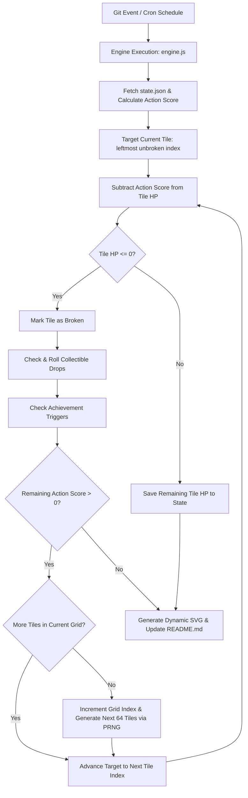
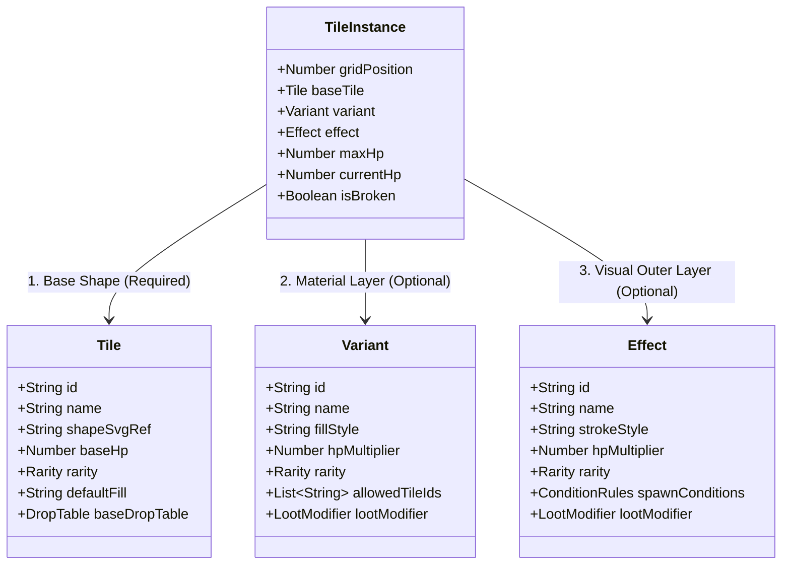

# BREAKME - Game Design Document (GDD)

> Single source of truth for BREAKME game rules, engine mechanics, state schemas, and visual architecture.

---

## 1. Game Concept & Core Loop

**BREAKME** is an idle incremental block-mining game embedded directly within a developer's GitHub profile `README.md`. Game progression is driven by real-world `git` activity and profile usage statistics.

### Key Mechanics & Rules
- **Grid Layout**: A 64-tile grid (8x8 visual wrapping grid). In engine memory/state, tiles are stored as a flat 1D array (`tiles[0..63]`).
- **Sequential Progression & Overflow Damage**:
  - Damage is applied sequentially to tiles from left to right (`index 0 -> 63`).
  - When an Action Score is applied, if a tile's HP reaches `<= 0` and remaining Action Score `> 0`, **overflow damage carries over** to the next tile immediately within the same cycle.
- **Continuous Seeded Grid Generation**:
  - The game seed is derived continuously from the player's GitHub Username / User ID.
  - When all 64 tiles in a grid are broken (`gridIndex`), the engine deterministically generates the next 64-tile grid derived from `PRNG(seed, gridIndex + 1)`.
- **3-Layer Stacking Entity System**:
  - **Layer 1: Base Tile Shape** *(Required)*: Base visual outline, base HP, base drop table.
  - **Layer 2: Material Variant** *(Optional)*: Visual fill/gradient overlay, HP bonus, score multipliers.
  - **Layer 3: Effect Modifier** *(Optional)*: Border/glow style, keyframe animation, visual overlays, special hit modifiers.
  - *Tile Composition*: A tile can consist of 1 layer (Base), 2 layers (Base + Variant OR Base + Effect), or 3 layers (Base + Variant + Effect).
- **Git Action Scoring**:
  - Engine parses user statistics: Action Type (`commit`, `PR merge`, `issue`), daily frequency, day consistency, period between actions, and active streaks.
  - Generates an **Action Score** subtracted from the current target tile's HP.
- **Collectibles & Achievements**:
  - Breaking tiles drops collectibles into the player's permanent Collection Log based on drop rates and unlock conditions.
  - Achievements trigger upon reaching progress milestones, breaking rare blocks, or achieving specific Git activity metrics.

---

## 2. Execution & Multi-Tile Hit Resolution Flow

---

## 3. Entity Specifications & 3-Layer Stacking Architecture

This section defines all primary domain entities in **BREAKME**.

### 3.1 World Entities & 3-Layer Block Composition

A tile block on the grid is composed of up to 3 stacked entity layers:

#### Layer 1: Base Tile Shape (`Tile`)
- **Role**: Defines the fundamental vector geometry shape and baseline health.
- **Visuals**: SVG `<path>` shape reference. Renders with `defaultFill` if no Variant is applied.
- **Properties**: `id`, `name`, `baseHp`, `rarity` (`common`, `uncommon`, `rare`, `legendary`), `baseDropTable`.

#### Layer 2: Material Variant (`Variant`)
- **Role**: Overlays material styling and scales block durability.
- **Visuals**: Replaces fill with solid colors, linear/radial gradients, or vector SVG patterns.
- **Properties**:
  - `hpMultiplier`: Scales tile HP (`Base HP * hpMultiplier`).
  - `rarity`: Determines spawn frequency.
  - `allowedTileIds`: Restricts variant to specific Tile types (optional).
  - `lootModifier`: Modifies drop pools (expands, shrinks, or replaces drop rates).

#### Layer 3: Effect Modifier (`Effect`)
- **Role**: Applies an outer stroke boundary/glow and special gameplay modifiers.
- **Visuals**: Renders outer stroke/outline styling (colors, dash patterns, CSS keyframe animations).
- **Properties**:
  - `hpMultiplier`: Secondary durability scalar.
  - `rarity`: Determines spawn frequency.
  - `spawnConditions`: Restricts appearance to specific Tiles, position indices, or Tile+Variant combos.
  - `lootModifier`: Secondary drop pool modifier.

#### Combined Tile Health Formula
$$\text{Max HP} = \lceil \text{Tile.baseHp} \times \text{Variant.hpMultiplier} \times \text{Effect.hpMultiplier} \rceil$$
*(Note: If Variant or Effect is missing, their multiplier defaults to 1.0)*

---

### 3.2 Player Entity (`Player`)
> *TODO: Detailed properties, stats, streak tracking, and profile state definition.*

---

### 3.3 Collectible Entity (`Collectible`)
> *TODO: Unlockable types, trophy cabinet log, drop rates, and condition schema.*

---

### 3.4 Achievement Entity (`Achievement`)
> *TODO: Achievement criteria, milestone badges, Git action triggers, and rewards.*

---

### 3.5 Chunk Entity (`Chunk`)
> *TODO: 64-tile grid chunk state, seed derivation, index progression, and layout metadata.*

---

### 3.6 Action Stack Entity (`ActionStack`)
> *TODO: Incoming Git inputs queue (commits, PR merges, issues), payload structures, and parsing rules.*

---

### 3.7 Action Score Entity (`ActionScore`)
> *TODO: Action score output, damage calculation formula, combo multipliers, and hit application specs.*
